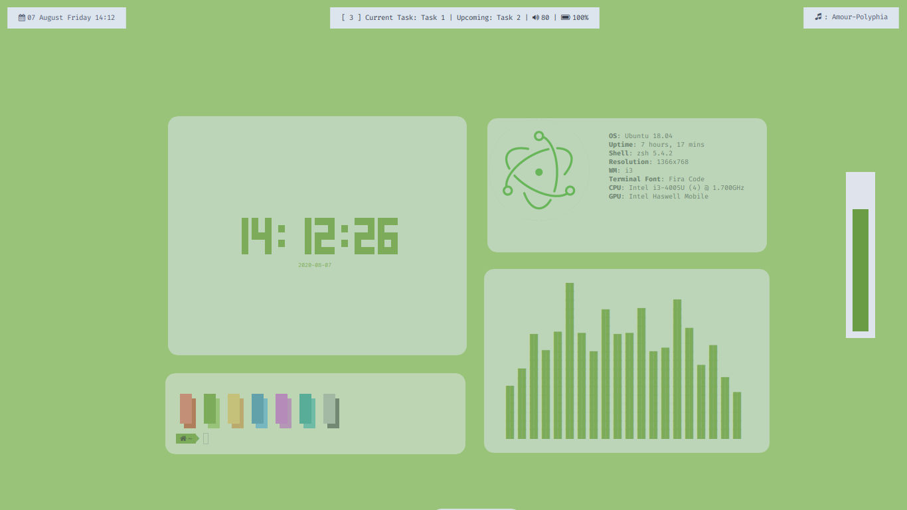
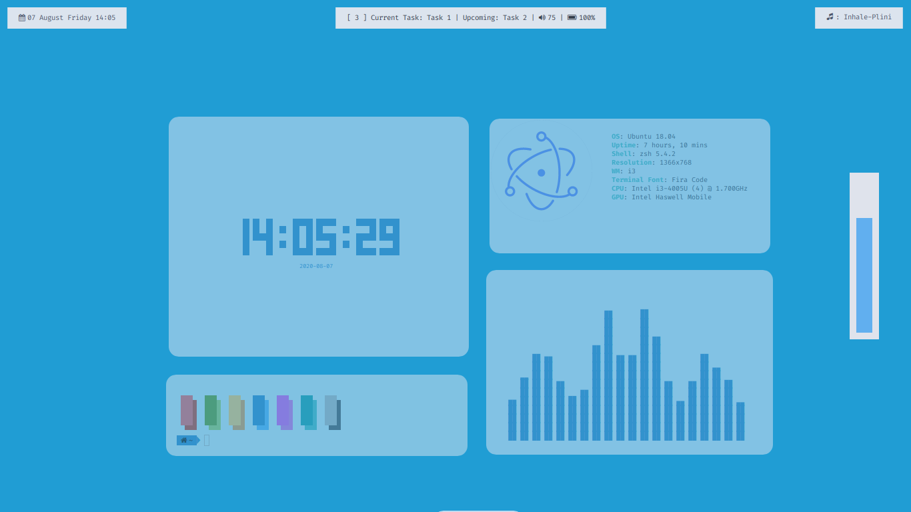

# Blood i3 
## Preview:

*

* The above image (new) uses the material_tint2_top and material_tint2_bottom

## Things to remember:
* The status bar is *tint2* and it uses the given *tint2rc*.
* The scripts *multistat*, *toDo*, *screencast_start*, *wallshift*,*clearToDo* and *modToDo* must be stored in /bin/
* The scripts *music.sh, info.sh, musicstat.sh, time.sh* must be stored in the HOME directory.
* To play music, your songs must be stored in *~/Music/All*
* *.wallpaper.jpg* should be in the HOME directory.

## The bar:

* The tint2 bar is running the *info.sh, musicstat.sh, time.sh* scripts for status.
* Scroll for adjusting volume.
* Left and right click for switching workspaces.
* Left Click on the music module for playing music.
* Right click on the music module to stop music.
* Left Click on the time module to add tasks.
* Right Click on the time module to delete tasks

## Useful Keybindings
* mod+m: Start Music
* mod+Shift+m:  Stop Music
* mod+Shift+w : Swap Wallpaper (Swaps .wallpaper.jpg with .wallpaper2.jpg and vice-versa in $HOME)
* mod+d: Add Tasks
* mod+Shift+d: Clear Tasks
* mod+Control+d: Delete all existing tasks
* mod+space: Launch rofi
* mod+Shift+space: Launch drun rofi
* mod+x: Launch rofi overview menu (new)

## Programs required:
* Rofi (for launching music and schedule scripts)
* tint2
* sdhand/picom (for rounded corners)
* sox (for music)
